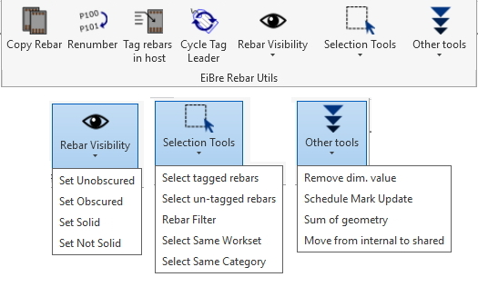
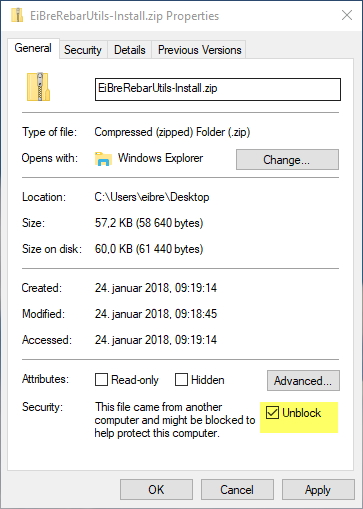

# EiBreRebarUtils
A collection of small tools for faster production in Autodesk Revit.

Supports Revit 2019, 2020, 2021 and 2022

## Usage
This addin creates a section in the Add-In ribbon:

Most of the commands are made for faster detailing when tagging 3D-reinforcent. Some of the commands are more general, such as "Cycle Tag Leader", "Select Same Category", "Select Same Workset" and Sum of Geometry.

Renumber Rebar lets you change the Rebar Number parameter, which is not supported by Revit in the user interface. Copy rebar works best for copying rebar between line based elements such as beams an walls.

Three new commands are added:
 * Rebar in Bend: Pick a bent rebar and a straight rebar in all bends with same diameter as the bent bar gets generated.
 * Pick and tag Rebar: Lets you choose which bar in a rebar set is set to visible, attach it to a distribution line and tag in two clicks.
 * Edit parameters from text: Let's you edit a rebars parameters by writing a string such as "ø12c200-P UK" to save a lot of mouses clicks.
 
## Installation

Download and unzip [EiBreRebarUtils-Installl.zip](Install/) and run Install.bat in the folder named after the Revit version it is made for.

Or simply copy EibreRebarUtils.addin and EibreRebarUtils.dll to
the [Revit Add-Ins folder](http://help.autodesk.com/view/RVT/2018/ENU/?guid=Revit_API_Revit_API_Developers_Guide_Introduction_Add_In_Integration_Add_in_Registration_html).

You might need to unblock the zip file to make it work:

## Author

Einar Raknes is a structural engeneer working at [Norconsult AS](http://www.norconsult.com) in Trondheim, Norway.
Coding is a hobby, and this addin is created mostly for the sake of learing.

## License

This Add-in is licensed under the terms of the [MIT License](http://opensource.org/licenses/MIT).
